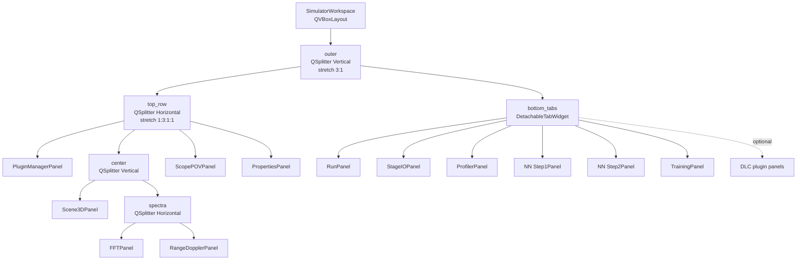
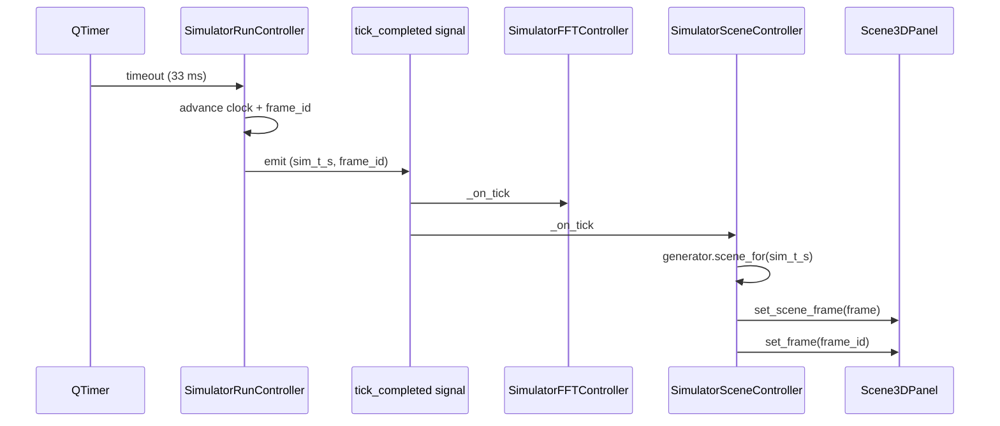

# Simulator Workspace 설계 문서

Simulator 의 8 + 1 패널 (8 top-row panel + bottom tab group) 의
구조·데이터 흐름 다이어그램 모음. 진입점은
`src/workbench/ui/simulator/workspace.py` 의 `SimulatorWorkspace`.

## 전체 레이아웃

```
+---------------+----------------------+--------------+--------------+
|               |   Scene3DPanel       |              |              |
| Plugin        +----------------------+ Scope POV    | Properties   |
| Manager       |  FFT  |  RD          | Panel        | Panel        |
| Panel         |       |              |              |              |
+---------------+----------------------+--------------+--------------+
| Bottom tabs: Run | Stage I/O | Profiler | NN Step 1/2 | Training |  |
|              [+ DLC panels appended on right]                       |
+---------------------------------------------------------------------+

stretch:   1   :     3       :    1     :    1            (top_row)
           top : bottom = 3 : 1                            (outer)
default size [px]: 240 : 640 : 240 : 240                  (top_row.setSizes)
                   520 : 220                              (outer.setSizes)
```

## QSplitter 트리



## Controller ↔ Panel 매트릭스

`SimulatorWorkspace` 가 보유한 모든 controller 의 wiring. 매 tick
(`run_controller.tick_completed`) 마다 신호가 흘러 패널을 업데이트.

| Controller | 패널 | mock generator | Phase |
|---|---|---|---|
| `SimulatorRunController` | `RunPanel` | — (자체 `SimulationClock`) | L1 |
| `SimulatorFFTController` | `FFTPanel` | `MockSpectrumGenerator` | L2 |
| `SimulatorRDController` | `RangeDopplerPanel` | `MockRangeDopplerGenerator` | L3 |
| `SimulatorSceneController` | `Scene3DPanel` | `MockSceneGenerator` | L4 |
| `SimulatorStageIOController` | `StageIOPanel` | `MockStageIOGenerator` | L5 |
| (없음 — direct seed) | `PluginManagerPanel` | `DEFAULT_PLUGIN_NAMES` | L5 |
| `SimulatorPrimaryTargetController` | `ScopePOVPanel` + `PropertiesPanel` | `MockPrimaryTargetGenerator` | L6 |

`RunController` 가 **마스터 시계** — 다른 controller 는 전부
`tick_completed(sim_t_s, frame_id)` 에 connect 해서 그 시각의 mock
프레임을 그린다. 어떤 패널이든 `controller.set_enabled(False)` 로
격리 가능 (`MVP_VERIFICATION_TREE.md § 5`).

## 신호 흐름 (요약)



다른 controller 도 동일한 fan-out 패턴.

## 패널 문서 인덱스

| 패널 | 문서 | 상태 |
|---|---|---|
| Scene3DPanel | [scene_3d_panel.md](scene_3d_panel.md) | ✓ |
| FFTPanel | — | ☐ TODO |
| RangeDopplerPanel | — | ☐ TODO |
| RunPanel | — | ☐ TODO |
| PropertiesPanel | — | ☐ TODO |
| ScopePOVPanel | — | ☐ TODO |
| PluginManagerPanel | — | ☐ TODO |
| StageIOPanel | — | ☐ TODO |
| ProfilerPanel | — | ☐ TODO |

작성 우선순위는 사용자가 코드 들어가 보면서 헷갈리는 순서.
