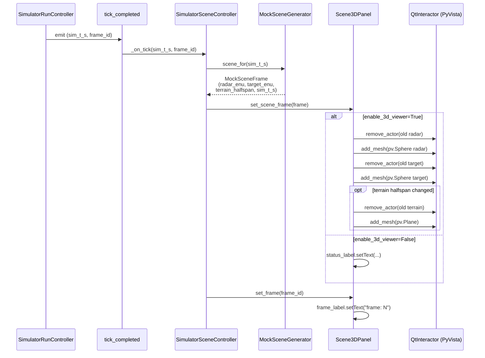
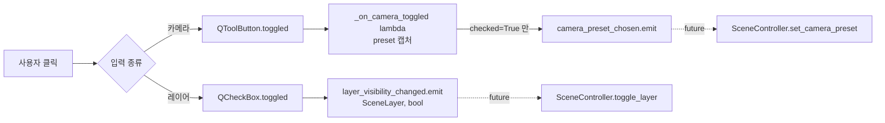

# Scene3DPanel — 3D Scene 패널 상세 설계

> **코드 경로**: `src/workbench/ui/simulator/panels/scene_3d_panel.py`  
> **컨트롤러**: `src/workbench/ui/simulator/scene_controller.py`  
> **데이터 소스**: `src/workbench/app/simulator/mock_scene.py`  
> **plan 참조**: plan/05 § 5.3.2, plan/05 § 5.5.4b (camera presets)  
> **빌드 페이즈**: Phase 4.10 (skeleton) → Phase 4 L4 (live PyVista actors)

---

## 1. 위치와 역할

Simulator 워크스페이스의 **중앙 상단** 칸. 3rd-person view 로 지형 +
레이더 + 표적을 한꺼번에 보여주는 패널. 사용자가 카메라 프리셋
(Top/Left/Free/Radar) 을 클릭해 시점을 바꿀 수 있고, 우측 11 개
레이어 체크박스로 표시 항목을 토글한다.

```
SimulatorWorkspace top_row (4 col, stretch 1:3:1:1)
+---------------+----------------------+--------------+--------------+
| Plugin Mgr    | ★ Scene3DPanel ★    | Scope POV    | Properties   |
| (column 0)    |   (column 1 top)     | (column 2)   | (column 3)   |
|               +----------------------+              |              |
|               | FFT  |  RD           |              |              |
+---------------+----------------------+--------------+--------------+
```

---

## 2. UI 레이아웃 (패널 내부)

```
+-------------------------------------------------------------+
| 3D Scene (3rd-person)   Camera:  [T] [L] [F] [R]   frame: 42|  ← _build_camera_row
+-------------------------------------------------+-----------+
|                                                 | Layers    |
|                                                 |           |
|                                                 | [x] terrain
|        +----------------------------+           | [x] sea
|        |                            |           | [x] buildings
|        |   QtInteractor             |           | [x] ships
|        |   (pyvistaqt — VTK OpenGL) |           | [x] tx_beam_actual
|        |                            |           | [ ] tx_beam_command
|        |   OR (headless fallback)   |           | [x] gt_targets
|        |                            |           | [ ] detections
|        |   QLabel "3D canvas..."    |           | [x] tracks
|        |                            |           | [x] primary_highlight
|        +----------------------------+           | [ ] multipath
|                                                 |           |
|        (minSize 320 x 240)                      |           |
+-------------------------------------------------+-----------+
   ←──────── stretch 1 (canvas) ─────────────→     ←  0  →    (QHBoxLayout body)
```

---

## 3. 위젯 계층

```mermaid
graph TD
  Panel[Scene3DPanel<br/>QWidget<br/>QVBoxLayout]
  Panel --> CamRow[Scene3DCameraRow<br/>QWidget<br/>QHBoxLayout]
  Panel --> Body[body<br/>QHBoxLayout]
  CamRow --> Title["QLabel<br/>'3D Scene (3rd-person)'"]
  CamRow --> CamLabel[QLabel 'Camera:']
  CamRow --> BG[QButtonGroup<br/>exclusive=True]
  BG --> BT[QToolButton 'Top (T)']
  BG --> BL[QToolButton 'Left (L)']
  BG --> BF[QToolButton 'Free (F)']
  BG --> BR[QToolButton 'Radar (R)']
  CamRow --> FrameLabel["QLabel 'frame: -'"]
  Body --> Canvas[Scene3DCanvas<br/>QFrame StyledPanel]
  Body --> Layers[Scene3DLayers<br/>QGroupBox<br/>QVBoxLayout]
  Canvas --> Inner{enable_3d_viewer?}
  Inner -->|True| QI[pyvistaqt.QtInteractor<br/>native OpenGL]
  Inner -->|False| Status["QLabel '3D canvas...'<br/>centered, gray"]
  Layers --> CB1[QCheckBox terrain]
  Layers --> CB2[QCheckBox sea]
  Layers --> CB3[QCheckBox ...]
  Layers --> CB11[QCheckBox multipath]
```

---

## 4. 공개 API · 시그널

### 시그널

| 이름 | 페이로드 | 발화 시점 |
|---|---|---|
| `camera_preset_chosen` | `CameraPreset` | 카메라 라디오 버튼 toggle (checked=True) |
| `layer_visibility_changed` | `(SceneLayer, bool)` | 레이어 체크박스 toggle |

### 메서드 (controller 가 호출)

| 시그니처 | 동작 |
|---|---|
| `set_scene_frame(frame: MockSceneFrame)` | 레이더 + 타깃 actor 교체. terrain 은 halfspan 변경 시만 refresh. headless 일 땐 status 라벨 업데이트로 대체 |
| `set_frame(frame_index: int)` | 헤더의 `frame: N` 카운터 갱신 |

### 테스트 헬퍼

| 시그니처 | 용도 |
|---|---|
| `select_camera(preset)` | 라디오 버튼 프로그램적 클릭 (signal emit) |
| `camera_button(preset) -> QToolButton` | 특정 카메라 버튼 직접 핸들 |
| `layer_check(layer) -> QCheckBox` | 특정 레이어 체크박스 직접 핸들 |
| `frame_label() -> QLabel` | 헤더 카운터 위젯 |
| `status_label() -> QLabel` | 헤드리스 모드 placeholder |
| `is_3d_viewer_enabled() -> bool` | constructor kwarg 회수 |
| `interactor() -> QtInteractor \| None` | VTK interactor (headless 면 None) |
| `radar_actor()` / `target_actor()` / `terrain_actor()` | PyVista actor 핸들 |

---

## 5. 데이터 흐름

### 5.1 controller 의 매 tick 흐름



### 5.2 카메라 / 레이어 입력 흐름 (사용자 → 시그널)



> **참고**: 현재 (MVP) 시그널은 emit 만 되고 SceneController 가
> 수신해서 카메라/레이어 상태에 반영하는 부분은 placeholder. 후속
> sub-step 에서 wire 예정.

---

## 6. enum · 상수

### `SceneLayer` (StrEnum, 11 값)

| 값 | 기본 ON | 의미 |
|---|---|---|
| `terrain` | ✓ | 지형 placeholder plane |
| `sea` | ✓ | 해수면 |
| `buildings` | ✓ | 건물 메쉬 |
| `ships` | ✓ | 함정 표적 |
| `tx_beam_actual` | ✓ | 실제 송신 빔 cone |
| `tx_beam_command` | ✗ | 명령된 송신 빔 (lag 비교용) |
| `gt_targets` | ✓ | Ground truth 표적 |
| `detections` | ✗ | CFAR 검출점 |
| `tracks` | ✓ | 추적 필터 출력 |
| `primary_highlight` | ✓ | Primary target 강조 |
| `multipath` | ✗ | 다중경로 ray |

기본 ON 8개 — `_DEFAULT_ON: frozenset[SceneLayer]`. 정의 순서가
체크박스 표시 순서.

### `CameraPreset` (StrEnum, 4 값)

| 값 | 라벨 | 단축 |
|---|---|---|
| `top` | Top | T |
| `left` | Left | L |
| `free` | Free | F |
| `radar` | Radar | R |

라벨·단축은 `_CAMERA_LABEL` / `_CAMERA_KEY` dict 에서 매핑.

### 마커 크기

| 상수 | 값 | 단위 | 용도 |
|---|---|---|---|
| `_RADAR_MARKER_RADIUS_M` | `80.0` | m | 레이더 위치 `pv.Sphere` 반지름 |
| `_TARGET_MARKER_RADIUS_M` | `60.0` | m | 표적 위치 `pv.Sphere` 반지름 |

mock terrain halfspan 은 `MockSceneGenerator` 의 default `8000 m`.
표적은 반지름 `4000 m` 원궤도 / 주기 `30 s` / 고도 `500 m`.

---

## 7. Lazy QtInteractor 패턴 (헤드리스 우회)

VTK / pyvistaqt 는 import 시점에 **OpenGL 컨텍스트** 를 요구. CI
샌드박스 (libegl1 없음) 와 일부 개발 환경에서 import 자체가 실패함.

해법: constructor kwarg `enable_3d_viewer: bool = True`.

```python
# Production (trsim ui)
panel = Scene3DPanel(enable_3d_viewer=True)
#   → _build_canvas() 가 "from pyvistaqt import QtInteractor" 실행
#   → self._interactor 가 실제 VTK 위젯

# Headless test / CI
panel = Scene3DPanel(enable_3d_viewer=False)
#   → pyvistaqt import 안 함
#   → self._interactor = None
#   → status QLabel 이 canvas 자리에 들어감
```

`set_scene_frame()` 도 두 경로:

| 경로 | 동작 |
|---|---|
| `enable_3d_viewer=True` | `pv.Sphere` / `pv.Plane` actor 생성 + `interactor.add_mesh` |
| `enable_3d_viewer=False` | `status_label.setText("3D canvas (headless) radar=(E,N,U) target=(E,N,U)")` |

이 패턴은 PhysicsLab 의 `TestObject3DPanel` (PL-9.1d) 과 동일.
`tests/unit/ui/physics_lab/conftest.py` 가 `pyvista.OFF_SCREEN = True`
까지 추가로 셋업.

### Focus + mouse tracking

```python
self._interactor.setFocusPolicy(Qt.FocusPolicy.StrongFocus)
self._interactor.setMouseTracking(True)
```

`StrongFocus` 가 없으면 VTK render window 가 키보드 / 휠 이벤트를
받지 못해 카메라 trackball 조작이 inert 함 (재현: Windows 11 + Qt 6.11).
`setMouseTracking(True)` 이 없으면 호버 motion 이 안 들어와서
camera spin / pan 이 click 이후에만 작동.

---

## 8. 알려진 함정

### 8.1 ✗ 인접 패널의 BitBlt 잔상 — `MVP_VERIFICATION_TREE.md § 4`

창 maximize / drag-resize 시 FFT / RangeDoppler 의 pyqtgraph
PlotWidget 가 그렸던 픽셀이 Scene3DPanel 의 VTK OpenGL surface 영역
에 **복사된 채로 남아** 잔상으로 보임.

**가설**: Qt 가 layout 변경 시 sibling widget 의 기존 픽셀을 새
위치로 BitBlt 으로 옮기는데, VTK native window 영역은 alien widget
(pyqtgraph) 의 paint region 으로 invalidate 되지 않음. Native
OpenGL surface 가 다음 frame 을 그릴 때까지 stale graphic 이 보임.

**시도해볼 fix path** (후속 cycle):
- A. `Scene3DPanel.resizeEvent` override → `self.update()` + `self._interactor.render()` 강제
- B. `SimulatorWorkspace.resizeEvent` 에서 child widget 들에 broadcast `update()`
- C. `QtInteractor` 를 native 가 아닌 alien widget 으로 강제 (`WA_DontCreateNativeAncestors`)

### 8.2 Phase 4 L4 placeholder 의 한계

현재 `set_scene_frame` 은 매 tick 마다 `remove_actor` + `add_mesh`
2회 (레이더, 타깃). 즉, **사용자가 카메라 trackball 조작하는 동안
mesh 가 매 tick 깜빡임**. terrain 만 halfspan 안 바뀌면 skip — 다른
actor 도 같은 in-place 업데이트로 바꿔야 (e.g. `actor.SetPosition(...)`).
후속 sub-step 후보.

### 8.3 시그널 미수신

`camera_preset_chosen` / `layer_visibility_changed` 두 시그널은
SceneController 가 **현재 수신 안 함**. 사용자가 카메라 버튼 누르면
시그널은 발사되지만 그 결과로 VTK 카메라가 바뀌지는 않음. 이건
plan/05 § 5.5.4b 의 후속 wiring 사항. 다이어그램의 점선 화살표
(`-.future.->`) 가 그 부분.

### 8.4 QtInteractor 직접 참조 패턴

`Any | None` 으로 type 표기 — pyvistaqt 가 mypy stubs 없어서.
`pyproject.toml § [[tool.mypy.overrides]]` 에 `pyvistaqt.*` 가
`ignore_missing_imports`. 코드에서 `self._interactor` 다룰 때
None-check 반드시.

---

## 9. 변경 이력

| 날짜 | 변경 | 커밋 |
|---|---|---|
| 2026-05-14 | 초안 작성 (Phase 4 L4 시점 코드 기반) | (이번 cycle) |

후속 cycle 에서 § 8.1 fix 가 들어가면 그 시점 변경 한 줄 추가.
